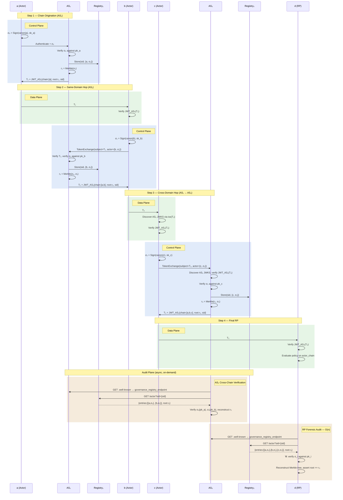

# End-to-End Federated Actor Chain Flow

**Scenario:** `a → b → c → d` where `a, b ∈ AS₁` and `c, d ∈ AS₂`

**Actors vs. Audience:** Each entity in the chain plays one or both roles:

| Entity | Audience (receives token) | Actor (signs + exchanges) |
|:---|:---|:---|
| `a` | — | ✅ Actor only (originator) |
| `b` | T₁ | ✅ Both — verifies T₁, then signs and exchanges for T₂ |
| `c` | T₂ | ✅ Both — verifies T₂, then signs and exchanges for T₃ |
| `d` | T₃ | Audience only (terminal RP) |

Only actors (`a`, `b`, `c`) sign identity claims, appear in `actor_chain`, and get Merkle tree leaves. The terminal RP (`d`) consumes the token but has no chain entry. If `d` delegates onward, it becomes an actor.

**Planes:**

| Plane | When | What |
|:---|:---|:---|
| **Data Plane** (green) | Every hop | Receive token, verify JWT — O(1) |
| **Control Plane** (blue) | Token exchange | Sign identity, verify, store, build Merkle, issue token |
| **Audit Plane** (tan) | On-demand, async | Cross-chain verification, forensic audit |

## Sequence Diagram



## Simplified Crypto Model

### Per-Actor Signature (standalone — no cumulative hashing)

Each actor signs only its own identity claims:

```
σ_i = Sign(canon(sub_i, iss_i, iat_i), sk_i)
```

No dependency on predecessors. One hash, one sign, regardless of chain depth.

### Merkle Root (ordering enforced by AS)

The AS constructs the Merkle tree with signatures as ordered leaves:

```
r_n = MerkleRoot(σ_0, σ_1, ..., σ_{n-1})
```

For the 3-actor chain at T₃:

```
node_01 = H(σ_0 || σ_1)
node_2  = H(σ_2 || σ_2)      ← odd leaf, duplicated
r_3     = H(node_01 || node_2)
```

Reordering leaves changes the root → detected by comparing against the signed token.

### Responsibility Split

| Responsibility | Owner | Cost |
|:---|:---|:---|
| Sign own identity | **Actor** | O(1) — 1 hash, 1 sign |
| Validate signatures | **AS** | O(1) per exchange — verify incoming σ_i |
| Build Merkle tree | **AS** | O(n) — at each exchange |
| Store entries | **AS** (registry) | Append-only |
| Verify JWT (data plane) | **RP** | O(1) — 1 sig check |
| Full forensic audit | **Auditor** | O(n) — n sig checks + Merkle reconstruction |

## Token Evolution

| Token | Issuer | `actor_chain` | `actor_chain_root` |
|:---|:---|:---|:---|
| T₁ | AS₁ | `[a]` | `r₁ = Merkle(σ₀)` |
| T₂ | AS₁ | `[a, b]` | `r₂ = Merkle(σ₀, σ₁)` |
| T₃ | AS₂ | `[a, b, c]` | `r₃ = Merkle(σ₀, σ₁, σ₂)` |

## What Lives Where

| Location | Contains | Discovered Via |
|:---|:---|:---|
| **Token** | `actor_chain` entries, `actor_chain_root`, `sid` | Inline |
| **AS metadata** | `governance_registry_endpoint` | `iss` → `.well-known` |
| **Registry** | `{σ_i}` per actor (ordered) | AS metadata + `sid` query |

## Security Properties

| Property | Mechanism |
|:---|:---|
| **Participation proof** | Per-actor standalone σ_i (unforgeable without sk_i) |
| **Ordering proof (within AS)** | Merkle tree over ordered leaves (root pinned in signed token) |
| **Completeness (within AS)** | Merkle root changes if any leaf added/removed |
| **Data-plane integrity** | AS JWT signature |
| **Cross-domain trust** | Each σ_i verifiable via actor's own pk_i, independent of any AS |

## Design Notes (Current Cut)

### Session ID (`sid`) Carry-Forward

The same `sid` value is carried forward across all token exchanges in a delegation chain, including cross-AS hops. AS₂ reuses the `sid` from `T₂` (originated by AS₁) in `T₃` and in its own registry. This means:

- The `sid` acts as a **global correlation key** across all registries.
- An auditor can query both `R₁` and `R₂` with the same `sid` to reconstruct the full chain.
- This assumes `sid` values are globally unique (e.g., UUIDs). No per-AS sid mapping is required.

### Independent Merkle Trees per AS

Each AS builds its own independent Merkle tree over the `chain_sig` values it holds:

| AS | Merkle Root | Leaves |
|:---|:---|:---|
| AS₁ | `r₂ = Merkle(σ₀, σ₁)` | Actors `a`, `b` |
| AS₂ | `r₃ = Merkle(σ₀, σ₁, σ₂)` | Actors `a`, `b`, `c` (flat rebuild) |

AS₂ rebuilds the tree from all entries (including those forwarded from AS₁). The trees are not cryptographically linked — cross-AS ordering integrity relies on trusting the originating AS's JWT signature.

### Plane Separation

| Plane | Scope | Operations |
|:---|:---|:---|
| **Data Plane** | Each RP boundary (every hop) | Receive token + verify JWT — O(1) |
| **Control Plane** | Chain building | Sign identity, token exchange, AS verification |
| **Audit Plane** | Evidence storage + forensic | Registry store, Merkle tree, cross-chain sig verification |

In cross-AS hops, the receiving AS (AS₂) verifies the originating AS's JWT as a **control-plane** operation (trusting AS₁'s signature). The per-actor signature verification of upstream entries (`σ₀`, `σ₁`) is **audit-plane** work — deferred and async.

## Open Work Items

**Cross-AS Ordering and Completeness**: In the current design, ordering and completeness are enforced within a single AS domain via the Merkle tree. Across AS boundaries, the receiving AS could theoretically reorder or omit entries from the originating AS. The leading candidate solution is a subtree root model where AS2 uses AS1's root as a leaf node: `r3 = Merkle(r2, sig_2)`. This cryptographically binds AS2's tree to AS1's ordering without any token bloat.

**Per-AS Session ID Mapping**: An alternative to the carry-forward `sid` model is per-AS sid namespacing, where AS₂ mints its own `sid` and maps it to AS₁'s. This provides namespace sovereignty but requires a mapping table and complicates cross-AS auditing. Deferred to a future version.

**Notes**: The `sid` claim is reused from OpenID Connect Back-Channel Logout 1.0 (not defined in RFC 8693). Registry discovery uses the AS's `.well-known` metadata (`governance_registry_endpoint`), not an in-token claim.
