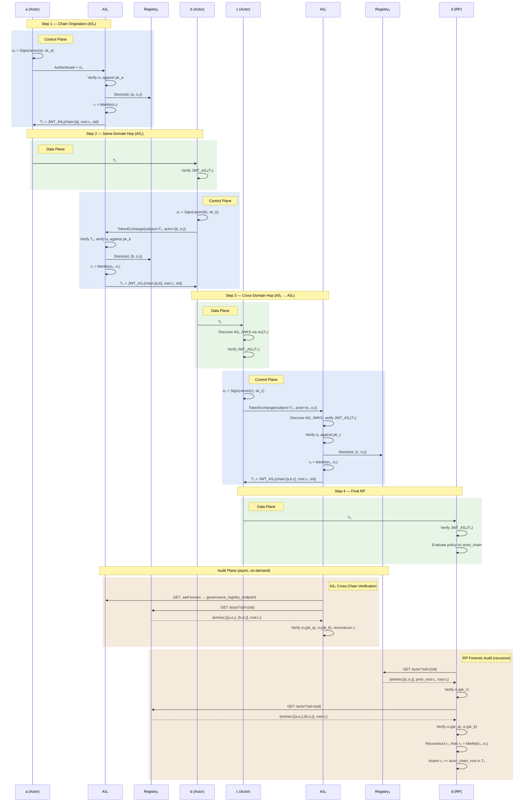

# End-to-End Federated Actor Chain Flow

**Scenario:** `a → b → c → d` where `a, b ∈ AS₁` and `c, d ∈ AS₂`

**Actors vs. Audience:** Each entity in the chain plays one or both roles:

| Entity | Audience (receives token) | Actor (signs + exchanges) |
|:---|:---|:---|
| `a` | — | ✅ Actor only (originator) |
| `b` | T₁ | ✅ Both — verifies T₁, then signs and exchanges for T₂ |
| `c` | T₂ | ✅ Both — verifies T₂, then signs and exchanges for T₃ |
| `d` | T₃ | Audience only (terminal RP) |

Only actors (`a`, `b`, `c`) sign identity claims, appear in `actor_chain`, and get Merkle tree leaves. The terminal RP (`d`) consumes the token but has no chain entry. If `d` delegates onward, it becomes an actor.

**Planes:**

| Plane | When | What |
|:---|:---|:---|
| **Data Plane** (green) | Every hop | Receive token, verify JWT — O(1) |
| **Control Plane** (blue) | Token exchange | Sign identity, verify, store, build Merkle, issue token |
| **Audit Plane** (tan) | On-demand, async | Cross-chain verification, forensic audit |

## Sequence Diagram



## Simplified Crypto Model

### Per-Actor Signature (standalone — no cumulative hashing)

Each actor signs only its own identity claims:

```
σ_i = Sign(canon(sub_i, iss_i, iat_i), sk_i)
```

No dependency on predecessors. One hash, one sign, regardless of chain depth.

### Merkle Root (subtree model)

Within a single AS, the Merkle tree is built from `chain_sig` leaves:

```
AS₁: r₁ = Merkle(σ₀)
     r₂ = Merkle(σ₀, σ₁)
```

Across AS boundaries, the receiving AS uses the upstream root as a leaf:

```
AS₂: r₃ = Merkle(r₂, σ₂)    ← r₂ trusted from verified JWT
```

This cryptographically binds AS₂'s tree to AS₁'s ordering — reordering or dropping any of AS₁'s entries changes `r₂`, which changes `r₃`. Zero token bloat (token still carries only the final root).

### Responsibility Split

| Responsibility | Owner | Cost |
|:---|:---|:---|
| Sign own identity | **Actor** | O(1) — 1 hash, 1 sign |
| Validate signatures | **AS** | O(1) per exchange — verify incoming σ_i |
| Build Merkle tree | **AS** | O(n) — at each exchange |
| Store entries | **AS** (registry) | Append-only |
| Verify JWT (data plane) | **RP** | O(1) — 1 sig check |
| Full forensic audit | **Auditor** | O(n) — n sig checks + Merkle reconstruction |

## Token Evolution

| Token | Issuer | `actor_chain` | `actor_chain_root` |
|:---|:---|:---|:---|
| T₁ | AS₁ | `[a]` | `r₁ = Merkle(σ₀)` |
| T₂ | AS₁ | `[a, b]` | `r₂ = Merkle(σ₀, σ₁)` |
| T₃ | AS₂ | `[a, b, c]` | `r₃ = Merkle(r₂, σ₂)` — subtree binding |

## What Lives Where

| Location | Contains | Discovered Via |
|:---|:---|:---|
| **Token** | `actor_chain` entries, `actor_chain_root`, `sid` | Inline |
| **AS metadata** | `governance_registry_endpoint` | `iss` → `.well-known` |
| **R₁ (AS₁)** | `{σ₀, σ₁}` — local entries | AS₁ metadata + `sid` |
| **R₂ (AS₂)** | `{σ₂}` + `prior_root: r₂` — local entry + upstream binding | AS₂ metadata + `sid` |

## Security Properties

| Property | Mechanism |
|:---|:---|
| **Participation proof** | Per-actor standalone σ_i (unforgeable without sk_i) |
| **Ordering proof (within AS)** | Merkle tree over ordered leaves (root pinned in signed token) |
| **Completeness (within AS)** | Merkle root changes if any leaf added/removed |
| **Cross-AS ordering** | Subtree root model: `r₃ = Merkle(r₂, σ₂)` binds AS₂ to AS₁'s ordering |
| **Data-plane integrity** | AS JWT signature |
| **Cross-domain trust** | Each σ_i verifiable via actor's own pk_i, independent of any AS |

## Design Notes (Current Cut)

### Session ID (`sid`) Carry-Forward

The same `sid` value is carried forward across all token exchanges in a delegation chain, including cross-AS hops. AS₂ reuses the `sid` from `T₂` (originated by AS₁) in `T₃` and in its own registry. This means:

- The `sid` acts as a **global correlation key** across all registries.
- An auditor can query both `R₁` and `R₂` with the same `sid` to reconstruct the full chain.
- This assumes `sid` values are globally unique (e.g., UUIDs). No per-AS sid mapping is required.

### Subtree Merkle Root Model

Each AS stores only its own entries and uses the upstream root as a subtree binding:

| AS | Registry Stores | Merkle Root |
|:---|:---|:---|
| AS₁ | `{σ₀, σ₁}` | `r₂ = Merkle(σ₀, σ₁)` — flat tree over local entries |
| AS₂ | `{σ₂}` + `prior_root: r₂` | `r₃ = Merkle(r₂, σ₂)` — subtree binding to AS₁ |

AS₂ trusts `r₂` from the verified JWT (control-plane trust). This cryptographically binds AS₂'s tree to AS₁'s ordering — reordering or dropping any of AS₁'s entries changes `r₂`, which changes `r₃`. Zero token bloat (only the final root is in the token).

### Plane Separation

| Plane | Scope | Operations |
|:---|:---|:---|
| **Data Plane** | Each RP boundary (every hop) | Receive token + verify JWT — O(1) |
| **Control Plane** | Chain building | Sign identity, store, build Merkle, token exchange, issue token |
| **Audit Plane** | Forensic, on-demand | Cross-chain sig verification, recursive Merkle audit |

In cross-AS hops, the receiving AS (AS₂) verifies the originating AS's JWT as a **control-plane** operation (trusting AS₁'s signature). The per-actor signature verification of upstream entries (`σ₀`, `σ₁`) is **audit-plane** work — deferred and async.

### Recursive Audit Verification

An auditor (or RP) performing forensic verification follows the registry chain:

1. Query R₂ (AS₂) by `sid` → gets `{σ₂}` and `prior_root: r₂`
2. Query R₁ (AS₁) by `sid` → gets `{σ₀, σ₁}`
3. Verify each `σ_i` against the actor's public key
4. Reconstruct `r₂ = Merkle(σ₀, σ₁)`, then `r₃ = Merkle(r₂, σ₂)`
5. Assert `r₃ == actor_chain_root` in the token

## Open Work Items

**Per-AS Session ID Mapping**: An alternative to the carry-forward `sid` model is per-AS sid namespacing, where AS₂ mints its own `sid` and maps it to AS₁'s. This provides namespace sovereignty but requires a mapping table and complicates cross-AS auditing. Deferred to a future version.

**Notes**: The `sid` claim is reused from OpenID Connect Back-Channel Logout 1.0 (not defined in RFC 8693). Registry discovery uses the AS's `.well-known` metadata (`governance_registry_endpoint`), not an in-token claim.
